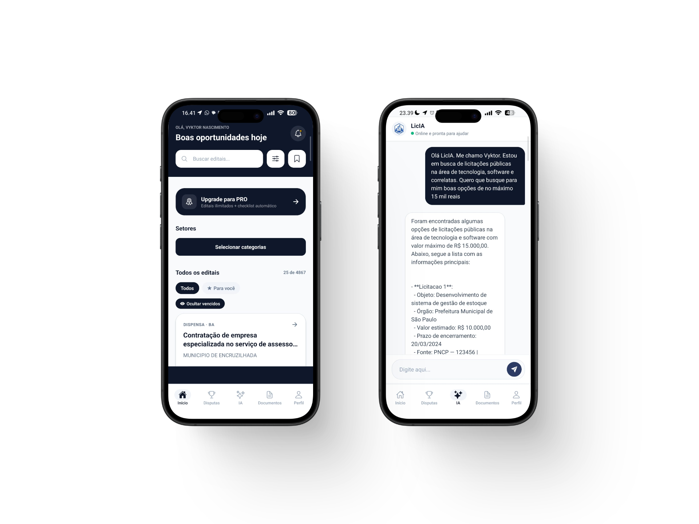
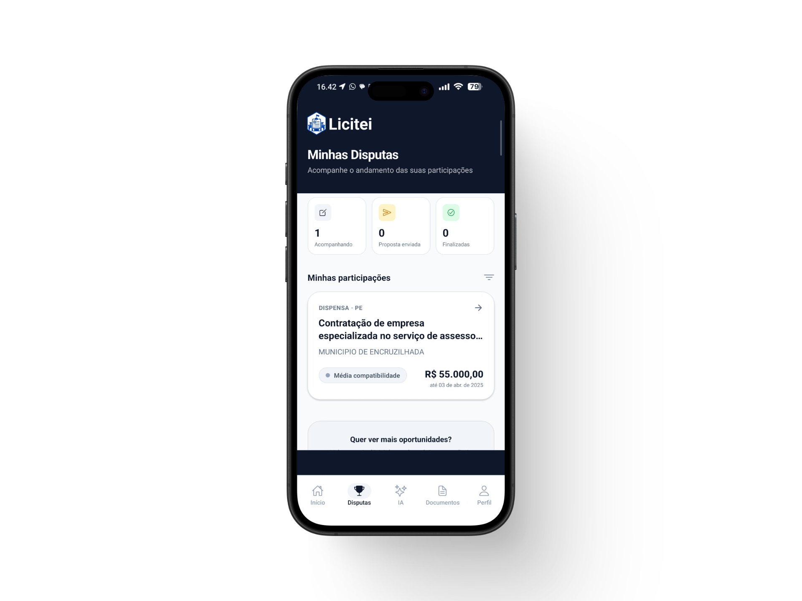
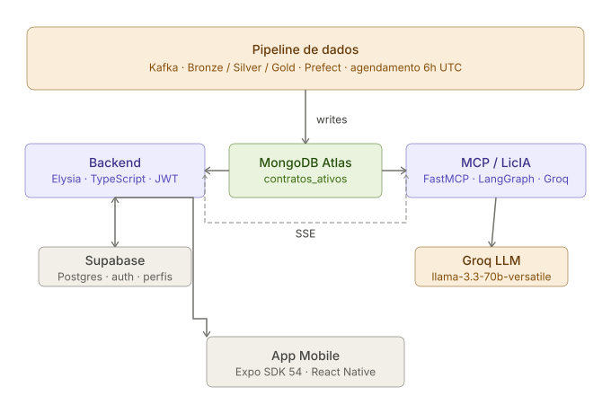

# Licitei

**Plataforma que conecta MEIs às licitações públicas do governo federal.**

*Projeto Integrador · CESAR School · ADS 5º período · Grupo 10*

---

## O problema

Participar de licitações públicas é burocrático e pouco acessível para pequenos empreendedores. As oportunidades existem — mas estão espalhadas em portais complexos, com linguagem técnica e sem filtros práticos para quem está começando.

## A solução

O **Licitei** consome dados em tempo real da API pública do [PNCP (Portal Nacional de Contratações Públicas)](https://www.gov.br/pncp), processa e organiza essas informações e as entrega via aplicativo mobile com um assistente de IA integrado — tornando as licitações visíveis e alcançáveis para MEIs.

---

## Screenshots

---

## Arquitetura

---

## Funcionalidades

| Funcionalidade | Descrição |
| --- | --- |
| Oportunidades personalizadas | Filtra editais pelo CNAE do MEI com teto de R$81k |
| Busca e filtros | Pesquisa por texto, UF, município, valor e categoria |
| Assistente LicIA | Chat com IA que interpreta editais em linguagem simples |
| Checklist de habilitação | Documentos necessários gerados automaticamente por edital |
| Gestão de participações | Acompanhe o status de cada licitação que você está disputando |
| Alertas de prazo | Notificações de editais encerrando em 7, 15 ou 30 dias |
| Pipeline automatizado | Ingestão diária de dados do PNCP com Prefect às 6h UTC |
| Dashboard de monitoramento | Streamlit com KPIs da pipeline em tempo real |

---

## Subprojetos

| Subprojeto | Descrição | Stack | README |
| --- | --- | --- | --- |
| `pipeline/` | ETL Kafka + Medallion (Bronze → Silver → Gold) | Python, Kafka, Parquet, Iceberg, MongoDB | [pipeline/README.md](pipeline/README.md) |
| `mcp/` | Servidor MCP + Agente LicIA | Python, FastMCP, LangGraph, Groq | [mcp/README.md](mcp/README.md) |
| `backend/` | API REST com autenticação JWT | TypeScript, Bun, Elysia, Supabase | [backend/README.md](backend/README.md) |
| `mobile/` | App React Native | Expo SDK 54, TypeScript, Axios | [mobile/README.md](mobile/README.md) |

---

## Stack completa

| Camada | Tecnologias |
| --- | --- |
| **Mobile** | React Native · Expo Router v6 · TypeScript · Supabase JS |
| **Backend** | Bun · Elysia · TypeScript · MongoDB Atlas · Supabase |
| **Pipeline** | Python · Apache Kafka · Parquet · Apache Iceberg · Prefect · Pydantic |
| **IA / MCP** | Python · FastMCP · LangGraph · LangChain · Groq · SQLite |
| **Banco de dados** | MongoDB Atlas · Supabase (Postgres) · SQLite |
| **Infra** | Docker · Railway (staging) |

---

## Como começar

| Subprojeto | Instruções |
| --- | --- |
| Backend + Mobile (setup local) | [SETUP.md](SETUP.md) |
| Pipeline (Kafka + Medallion) | [pipeline/README.md](pipeline/README.md) |
| Backend (API REST) | [backend/README.md](backend/README.md) |
| App Mobile (Expo) | [mobile/README.md](mobile/README.md) |
| MCP / Assistente LicIA | [mcp/README.md](mcp/README.md) |

---

## Time

| Membro | Papel |
| --- | --- |
| [Vyktor Fellype](https://www.linkedin.com/in/vyktor-nascimento/) | Porta-Voz · Gerente de Projeto · Pipeline · MCP |
| Pierre Costa | Guardião dos Dados · Track 5 — Negócios |
| Mariana Ferreira | Track 4 — Segurança |
| Pedro Diniz | Track 2 — Backend |
| Thaíssa Fernandes | Track 2 — Artefatos · Track 3 — MCP |
| Ylson dos Santos | Track 2 — Mobile · Track 5 — Negócios |
| Yuri Ricardo | Track 2 — Mobile |
| Júlia Veríssimo | Track 2 — Artefatos Mobile |

---

Desenvolvido na CESAR School · ADS 5º período · Grupo 10  
Dados extraídos da API pública do [PNCP — Portal Nacional de Contratações Públicas](https://www.gov.br/pncp)

