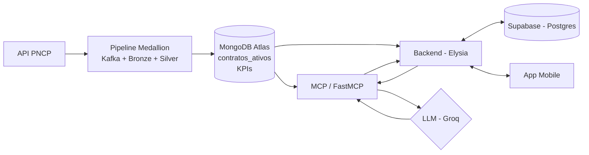

# Licitei

> Plataforma que simplifica o acesso de Microempreendedores Individuais (MEIs) às licitações públicas governamentais.

Projeto Integrador — 5º período de Análise e Desenvolvimento de Sistemas | [CESAR School](https://www.cesar.school/) | Grupo 10

---

## O problema

Participar de licitações públicas é burocrático e pouco acessível para pequenos empreendedores. As oportunidades existem — mas estão fragmentadas em portais complexos, com linguagem técnica e sem filtros práticos para quem está começando.

## A solução

O **Licitei** consome dados em tempo real da API pública do [PNCP (Portal Nacional de Contratações Públicas)](https://www.gov.br/pncp), processa e organiza essas informações e as entrega via aplicativo mobile com um assistente de IA integrado — tornando as licitações visíveis e alcançáveis para MEIs.

---

## Arquitetura


```mermaid
flowchart LR
    A[API PNCP] --> B[Pipeline Medallion\nKafka + Bronze + Silver]
    B --> E[(MongoDB Atlas\ncontratos_ativos\nKPIs)]
    E --> G[MCP / FastMCP]
    E --> I[Backend - Elysia]
    G --> H{LLM - Groq}
    H --> G
    I <--> D[(Supabase - Postgres)]
    I --> G
    G --> I
    I <--> J[App Mobile]
```

---

## Tracks

| Track | Descrição | Stack | Responsável |
| --- | --- | --- | --- |
| Track 1 — Dados | ETL batch + engenharia de dados | Python, MongoDB Atlas, Supabase | Vyktor |
| Track 1B — DataOps | Pipeline Kafka + arquitetura Medallion (Bronze→Silver→Gold) | Kafka, PyArrow, PyIceberg, Pydantic, Prefect | Vyktor |
| Track 2 — Mobile & Backend | App mobile e API REST | React Native, Elysia, TypeScript | Pedro, Yuri, Ylson, Júlia, Thaíssa |
| Track 3 — IA & MCP | Assistente inteligente via LLM | FastMCP, LangGraph, LangChain, Python, HTTP + SSE | Vyktor |
| Track 4 — Segurança | Revisão transversal de segurança | — | Mariana |
| Track 5 — Negócios | Monetização, métricas e UX | — | Ylson, Pierre |

---

## Estrutura do monorepo

```text
licitei/
├── pipeline/         # Track 1 + 1B — Pipeline Medallion unificado (Kafka + Bronze + Silver + Gold)
├── mcp/              # Track 3 — servidor FastMCP + LLM
├── backend/          # Track 2 — API REST (Elysia)
├── mobile/           # Track 2 — app React Native
├── docs/             # documentação técnica geral
└── temp/             # documentos de planejamento e sprint
```

Cada subprojeto é independente e possui seu próprio `README.md` com instruções de instalação e execução.

---

## Como começar

Escolha o track em que vai trabalhar e siga o README correspondente:

| Subprojeto | README |
| --- | --- |
| Pipeline (Kafka + Medallion + ETL) | [pipeline/README.md](pipeline/README.md) |
| Backend (API REST) | [backend/README.md](backend/README.md) |
| Mobile (app React Native) | [mobile/README.md](mobile/README.md) |
| MCP / IA (assistente LLM) | [mcp/README.md](mcp/README.md) |

---

## Branch strategy

| Branch | Uso |
| --- | --- |
| `main` | código em produção |
| `develop` | integração contínua — código funcionando |
| `feature/<descricao>` | desenvolvimento de funcionalidades |
| `chore/<descricao>` | configuração e infraestrutura |

---

## Time

| Membro | Papel | Contato |
| --- | --- | --- |
| Vyktor Fellype Pereira do Nascimento | Porta-Voz · Gerente de Projeto | [LinkedIn](https://www.linkedin.com/in/vyktor-nascimento/) |
| Pierre Costa Santiago de Oliveira Neto | Guardião dos Dados · Track 5 — Negócios | — |
| Mariana Ferreira Wanderley | Track 4 — Segurança | — |
| Pedro Diniz Bim Vasconcelos e Silva | Track 2 — Backend | — |
| Thaíssa Fernandes Siqueira Silva | Track 2 — Artefatos | — |
| Ylson dos Santos Queiroz Filho | Track 2 — Mobile · Track 5 — Negócios | — |
| Yuri Ricardo Albuquerque de França | Track 2 — Mobile | — |
| Júlia Veríssimo | Track 2 — Artefatos Mobile | — |

---

## 🔗 Links Rápidos

| Recurso | Link |
| --- | --- |
| Formulário Semanal (até terça 17h) | [forms.gle/bwTUUNx78rQUCw4e7](https://forms.gle/bwTUUNx78rQUCw4e7) |
| Repositório GitHub | [github.com/VyNas07/Licitei](https://github.com/VyNas07/Licitei) |
| API PNCP | [pncp.gov.br/api/consulta](https://pncp.gov.br/api/consulta) |
| Documentação Notion | [Projeto Integrador — MEI Licitações](https://www.notion.so/Projeto-Integrador-MEI-Licita-es-CESAR-School-33c97155b5d980dca01fe04fc306670e) |

---

Projeto desenvolvido na CESAR School — ADS 5º período · Grupo 10 · Dados extraídos da API pública do [PNCP — Portal Nacional de Contratações Públicas](https://www.gov.br/pncp)
