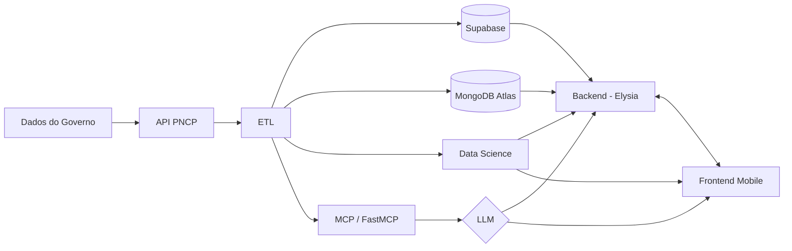

# Arquitetura — Licitei

## Visão geral

O **Licitei** resolve um problema de acesso e complexidade: as licitações públicas brasileiras
estão disponíveis no portal PNCP, mas sua interface e linguagem técnica são barreiras reais
para Microempreendedores Individuais (MEIs). A plataforma consome os dados diretamente da
API pública do PNCP via pipeline ETL, os processa e os armazena em bases otimizadas para
cada tipo de consulta.

O dado processado é servido por uma API REST (Elysia) consumida pelo app mobile e por um
servidor MCP (FastMCP) que alimenta um assistente de IA. O assistente interpreta editais
em linguagem natural, resume documentos e responde dúvidas do MEI — tornando as licitações
alcançáveis para quem não tem familiaridade com o processo público.

---

## Diagrama de arquitetura



---

## Camadas e responsabilidades

| Camada | Tecnologia | Responsabilidade |
|---|---|---|
| Extração | Python · `requests` | Paginação completa da API PNCP com retry e backoff exponencial |
| Transformação | Python · `pandas` | Normalização de campos, cast de tipos, descarte de registros inválidos |
| Carga documental | MongoDB Atlas | Armazenamento dos editais para consultas flexíveis e full-text |
| Carga relacional | Supabase (Postgres) | Dados estruturados: usuários, perfis MEI, buscas salvas |
| Análise | Python · scikit-learn | Modelos exploratórios e matching por ramo de atividade |
| Servidor MCP | FastMCP · Python | Tools expostas ao LLM: busca, resumo, documentos necessários |
| LLM | gpt-4o-mini (OpenAI) | Interpretação de linguagem natural, geração de respostas |
| Backend | Elysia · TypeScript | API REST com autenticação JWT, integração MongoDB + Supabase + MCP |
| Mobile | React Native | Interface do usuário: busca, detalhe do edital, assistente IA |

---

## Fluxo de dados

```
API PNCP
  └─► ETL (extractor → transformer → loader)
        ├─► MongoDB Atlas         — editais brutos normalizados
        └─► Supabase (Postgres)   — dados relacionais (usuários, perfil MEI)

MongoDB Atlas + Supabase
  └─► Backend Elysia (API REST)
        └─► Mobile React Native   — telas de busca, detalhe e perfil

MongoDB Atlas
  └─► Servidor MCP (FastMCP)
        └─► LLM (gpt-4o-mini)
              └─► Backend Elysia  — respostas do assistente via SSE
                    └─► Mobile    — tela do assistente IA
```

**Passo a passo:**

1. O pipeline ETL roda sob demanda ou agendado, consultando `/contratacoes/publicacao` e `/contratacoes/proposta` na API PNCP.
2. Os registros são normalizados (snake_case, tipos, campos aninhados) e persistidos via upsert no MongoDB Atlas e no Supabase.
3. O backend Elysia expõe endpoints REST autenticados por JWT, consultando MongoDB para editais e Supabase para dados do usuário.
4. O servidor MCP conecta-se ao MongoDB e expõe tools ao LLM: busca de editais, resumo de objeto, lista de documentos exigidos.
5. Quando o usuário aciona o assistente no app, o backend encaminha a mensagem ao MCP via HTTP + SSE; o MCP chama o LLM com as tools disponíveis e devolve a resposta em stream.
6. O Mobile consome os endpoints REST para as telas de busca e detalhe, e o stream SSE para a tela do assistente.
