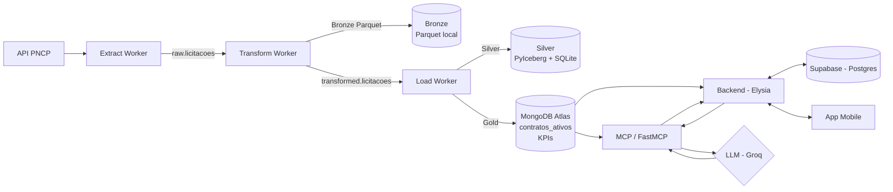

# Arquitetura — Licitei

## Visão geral

O **Licitei** resolve um problema de acesso e complexidade: as licitações públicas brasileiras
estão disponíveis no portal PNCP, mas sua interface e linguagem técnica são barreiras reais
para Microempreendedores Individuais (MEIs). A plataforma consome os dados diretamente da
API pública do PNCP via pipeline Medallion com Kafka, os processa em três camadas (Bronze →
Silver → Gold) e os armazena em bases otimizadas para cada tipo de consulta.

O dado processado é servido por uma API REST (Elysia) consumida pelo app mobile e por um
servidor MCP (FastMCP) que alimenta um assistente de IA. O assistente interpreta editais
em linguagem natural, resume documentos e responde dúvidas do MEI — tornando as licitações
alcançáveis para quem não tem familiaridade com o processo público.

---

## Diagrama de arquitetura


```mermaid
flowchart LR
    A[API PNCP] --> B[Extract Worker]
    B -->|raw.licitacoes| C[Transform Worker]
    C -->|Bronze Parquet| F[(Bronze\nParquet local)]
    C -->|transformed.licitacoes| D[Load Worker]
    D -->|Silver| S[(Silver\nPyIceberg + SQLite)]
    D -->|Gold| E[(MongoDB Atlas\ncontratos_ativos\nKPIs)]
    E --> G[MCP / FastMCP]
    E --> I[Backend - Elysia]
    G --> H{LLM - Groq}
    H --> G
    I <--> DB[(Supabase - Postgres)]
    I --> G
    G --> I
    I <--> J[App Mobile]
```

---

## Camadas e responsabilidades

| Camada | Tecnologia | Responsabilidade |
| --- | --- | --- |
| Extração | Python · `requests` | Extract Worker pagina a API PNCP e publica uma mensagem Kafka por licitação |
| Ingestão (Kafka) | Zookeeper + `confluentinc/cp-kafka:7.5.0` · `confluent-kafka` | Tópicos `raw.licitacoes` e `transformed.licitacoes` com DLQs para registros inválidos |
| Bronze | Apache Parquet · PyArrow | Dado bruto imutável, particionado por `year/month/day` — base para reprocessamento |
| Silver | Apache Iceberg · PyIceberg | Dado limpo, tipado, deduplicado — ACID e time travel via snapshots; upsert SQLite paralelo |
| Gold | MongoDB Atlas | `contratos_ativos` (coleção principal) + 5 coleções KPI agregadas do dataset completo |
| DLQ | Kafka topics `.dlq` | Preserva mensagens com erro sem bloquear o pipeline; monitorável independentemente |
| Dados do usuário | Supabase (Postgres) | Perfis MEI, participações, documentos e alertas — escritos pelo backend |
| Servidor MCP | FastMCP · Python · LangGraph ReAct | Tools expostas ao LLM: busca, listagem, data atual, resumo, checklist, documentos |
| LLM | Groq llama-3.3-70b-versatile (prod) · Ollama (dev fallback) | Interpretação de linguagem natural, geração de respostas |
| Backend | Elysia · TypeScript | API REST com auth JWT, integração MongoDB (`contratos_ativos`) + Supabase + MCP |
| Mobile | React Native · Expo Router | Interface do usuário: busca, detalhe, assistente IA, alertas, participações |

---

## Fluxo de dados

```text
API PNCP
  └─► Extract Worker (pipeline/)
        └─► Kafka raw.licitacoes
              └─► Transform Worker
                    ├─► Bronze (Parquet, particionado por year/month/day) — dado bruto imutável
                    └─► Kafka transformed.licitacoes
                          └─► Load Worker
                                ├─► Silver (PyIceberg — ACID, dedup, time travel)
                                ├─► SQLite  (upsert por numero_controle_pncp)
                                └─► Gold MongoDB Atlas
                                      ├─► contratos_ativos  — coleção principal de editais
                                      └─► kpi_por_uf · kpi_por_modalidade · kpi_prazos
                                          kpi_elegibilidade · kpi_dashboard

MongoDB Atlas (contratos_ativos + KPIs)
  ├─► Backend Elysia (API REST)   — GET /editais, GET /alertas
  └─► Servidor MCP (FastMCP)      — tools do assistente IA

Supabase (Postgres)
  └─► Backend Elysia              — perfil MEI, participações, documentos, alertas

Backend Elysia
  ├─► Servidor MCP (FastMCP)      — encaminha query via HTTP + SSE (proxy)
  └─► Mobile React Native         — API REST autenticada por JWT

Servidor MCP (LangGraph ReAct)
  └─► LLM Groq llama-3.3-70b-versatile (fallback: Ollama)
        └─► resposta streaming SSE → Backend → Mobile
```

**Passo a passo:**

1. O Extract Worker roda sob demanda ou agendado pelo Prefect, consultando `/contratacoes/publicacao` na API PNCP e publicando uma mensagem Kafka por licitação em `raw.licitacoes`.
2. O Transform Worker consome `raw.licitacoes`, grava o dado bruto em Parquet (Bronze), normaliza e enriquece os campos (snake_case, tipos, `elegivel_mei`, `dias_ate_encerramento`, `faixa_valor`) e publica em `transformed.licitacoes`. Registros inválidos vão para o DLQ sem bloquear o pipeline.
3. O Load Worker consome `transformed.licitacoes` e persiste nas três camadas: Silver (PyIceberg), SQLite e Gold (MongoDB). Os KPIs são recalculados após cada ciclo via agregação sobre o dataset completo.
4. O backend Elysia expõe endpoints REST autenticados por JWT, consultando `contratos_ativos` para editais e Supabase para dados do usuário.
5. O servidor MCP conecta-se ao MongoDB e expõe tools ao LLM (agente LangGraph ReAct): busca, listagem, resumo, checklist, documentos e data atual.
6. Quando o usuário aciona o assistente no app, o backend encaminha via HTTP + SSE; o MCP chama o LLM e devolve a resposta em stream.
