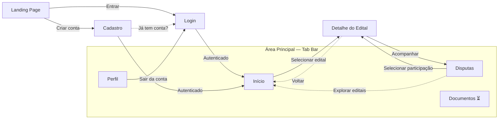

# Mapa de Navegação — Licitei Mobile

> **Sprint 1 — atualizado em 07/05/2026**
> Representa o estado implementado e validado no Milestone 1.
> Telas de Sprint 2+ são indicadas explicitamente.

---

## Diagrama

---

## Rotas

| Tela | Rota | Sprint | Status |
| --- | --- | --- | --- |
| Landing Page | `/` | 1 | ✅ Implementado |
| Login | `/(auth)/login` | 1 | ✅ Implementado |
| Cadastro | `/(auth)/cadastro` | 1 | ✅ Implementado |
| Início (listagem de editais) | `/(tabs)/home` | 1 | ✅ Implementado |
| Disputas (participações) | `/(tabs)/disputas` | 1 | ✅ Implementado |
| Detalhe do Edital | `/edital/[id]` | 1 | ✅ Implementado |
| Perfil | `/(tabs)/perfil` | 1 | ✅ Implementado |
| Documentos | `/(tabs)/documentos` | 2 | ⏳ Tela placeholder |
| Alertas | `/(tabs)/alertas` | 2 | ⏳ Oculto na tab bar |
| Planos PRO | `/(tabs)/planos` | 3 | ⏳ Oculto na tab bar |

---

## Proteção de rotas (Auth Guard)

O `_layout.tsx` raiz observa a sessão via `supabase.auth.onAuthStateChange` e aplica as seguintes regras automaticamente:

| Situação | Comportamento |
| --- | --- |
| Sem sessão tentando acessar `/(tabs)/*` | Redireciona para `/(auth)/login` |
| Com sessão na landing page `/` | Redireciona para `/(tabs)/home` |
| Com sessão em `/(auth)/*` | Redireciona para `/(tabs)/home` |

---

## Observações

- O parâmetro `[id]` em `/edital/[id]` é o `numero_controle_pncp` do MongoDB, que contém barras literais (ex: `11303906000100-1-000053/2026`). A navegação usa `{ pathname: '/edital/[id]', params: { id } }` para evitar fragmentação da rota.
- As abas **Alertas** e **Planos** existem no código mas estão ocultas na tab bar (`href: null`) até a implementação completa.
- O redirecionamento pós-"Acompanhar edital" ocorre automaticamente após 2 segundos, via `setTimeout` no modal de sucesso.
