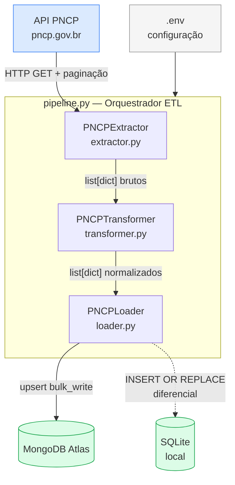

# ETL — Track 1

> Pipeline de extração, transformação e carga de dados do PNCP para o Licitei.

Parte do monorepo [Licitei](../README.md) · CESAR School — ADS 5º período · Grupo 10

**Responsável:** Vyktor Fellype Pereira do Nascimento

---

## O que este módulo faz

Consome a API pública do [PNCP (Portal Nacional de Contratações Públicas)](https://www.gov.br/pncp), normaliza os dados e os carrega no MongoDB Atlas. Opcionalmente persiste em SQLite local (diferencial). Os dados alimentam o backend, o módulo de Data Science e o assistente de IA do Licitei.

---

## Arquitetura



---

## Fluxo de Dados

| Etapa | Entrada | Saída | Operações principais |
| --- | --- | --- | --- |
| **Extract** | Configuração via `.env` | `list[dict]` brutos | Requisições paginadas à API PNCP, retry exponencial, tratamento de HTTP 204 |
| **Transform** | `list[dict]` brutos | `list[dict]` normalizados | Renomeação de campos, cast de tipos, extração de campos aninhados, descarte de registros inválidos |
| **Load** | `list[dict]` normalizados | Documentos no MongoDB e SQLite | Upsert via `bulk_write` (MongoDB), `INSERT OR REPLACE` (SQLite), criação de índice único |

---

## Variáveis de Ambiente

Copie `.env.example` para `.env` e preencha com seus valores. **Nunca commite o arquivo `.env`.**

| Variável | Descrição | Obrigatória |
| --- | --- | --- |
| `MONGO_URI` | URI de conexão com o MongoDB Atlas | Sim |
| `MONGO_DB_NAME` | Nome do banco de dados | Sim |
| `MONGO_COLLECTION` | Nome da coleção | Sim |
| `PNCP_BASE_URL` | URL base da API do PNCP | Não (padrão definido) |
| `PNCP_TAMANHO_PAGINA` | Registros por página (máx. 50) | Não (padrão: 50) |
| `PNCP_UF` | Filtro por estado (ex: `PE`) | Não (padrão: todos) |
| `PNCP_CODIGO_MODALIDADE` | Código da modalidade de contratação | Não (padrão: 8) |
| `PNCP_DATA_INICIAL` | Início do intervalo de consulta (`YYYYMMDD`) | Não (padrão: hoje) |
| `PNCP_DATA_FINAL` | Fim do intervalo de consulta (`YYYYMMDD`) | Não (padrão: hoje) |
| `SQLITE_DB_PATH` | Caminho para o arquivo SQLite | Não (desabilita SQLite se vazio) |
| `PNCP_TIMEOUT` | Timeout em segundos por requisição à API | Não (padrão: 60) |

---

## Como Executar

### Pré-requisitos

- Python 3.11+
- Conta no [MongoDB Atlas](https://www.mongodb.com/atlas) com uma cluster criada e URI de conexão disponível

### Instalação

```bash
# 1. Clone o repositório e entre no subprojeto ETL
git clone https://github.com/<seu-usuario>/licitei.git
cd licitei/etl

# 2. Crie e ative o ambiente virtual
python -m venv .venv

# Linux/Mac
source .venv/bin/activate

# Windows
.venv\Scripts\activate

# 3. Instale as dependências
pip install -r requirements.txt

# 4. Configure as variáveis de ambiente
cp .env.example .env
# Edite o arquivo .env com seus dados do MongoDB Atlas
```

### Execução do Pipeline

```bash
python -m src.etl.pipeline
```

Os logs são exibidos no console e salvos em `logs/pipeline_<data>.log`.

---

## Tecnologias

| Tecnologia | Uso |
| --- | --- |
| Python 3.11+ | Linguagem principal |
| [requests](https://docs.python-requests.org) | Requisições HTTP à API PNCP |
| [pandas](https://pandas.pydata.org) | Transformação e análise de dados |
| [pymongo](https://www.mongodb.com/docs/drivers/pymongo/) | Conexão e carga no MongoDB Atlas |
| [python-dotenv](https://pypi.org/project/python-dotenv/) | Gerenciamento de variáveis de ambiente |
| [loguru](https://loguru.readthedocs.io) | Logging estruturado com rotação de arquivos |
| [MongoDB Atlas](https://www.mongodb.com/atlas) | Banco de dados principal (nuvem) |
| [Streamlit](https://streamlit.io) | Dashboard interativo (diferencial) |
| [Plotly](https://plotly.com/python/) | Gráficos interativos no dashboard (diferencial) |

---

## SQLite — Persistência Local (diferencial)

O pipeline suporta uma segunda camada de persistência em SQLite, ativada ao definir `SQLITE_DB_PATH` no `.env`. Os dados são gravados na tabela `contratacoes` com `INSERT OR REPLACE`, garantindo deduplicação mesmo em execuções repetidas.

## Dashboard Streamlit (diferencial)

Painel de análise exploratória visual implementado com [Streamlit](https://streamlit.io) e [Plotly](https://plotly.com/python/). Exibe KPIs, gráficos interativos e tabela filtrável com os dados carregados no MongoDB Atlas.

```bash
streamlit run dashboard/app.py
```

---

## Estrutura

```text
etl/
├── src/
│   └── etl/
│       ├── extractor.py   # PNCPExtractor — extração com paginação e retry
│       ├── transformer.py # PNCPTransformer — normalização de campos e tipos
│       ├── loader.py      # PNCPLoader — carga no MongoDB e SQLite
│       └── pipeline.py    # Orquestrador ETL
├── dashboard/
│   └── app.py             # Painel Streamlit (diferencial)
├── docs/
│   └── architecture.md    # Documentação técnica de arquitetura
├── tests/
├── .env.example
├── requirements.txt
└── README.md
```
