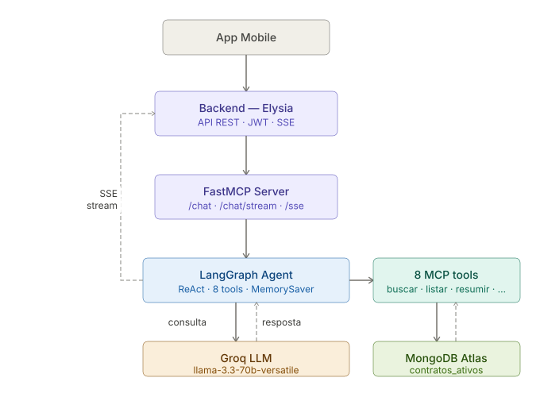

# Licitei MCP — LicIA, Assistente de IA

[](https://python.org)
[](https://github.com/jlowin/fastmcp)
[](https://langchain-ai.github.io/langgraph/)
[](https://groq.com)
[](https://mongodb.com)

**Track 3** — Projeto Integrador · CESAR School · ADS 5º período · Responsável: [Vyktor Nascimento](https://www.linkedin.com/in/vyktornascimento/)

Servidor [FastMCP](https://github.com/jlowin/fastmcp) que expõe 8 ferramentas de consulta a licitações para uso por LLMs. Integra um agente [LangGraph](https://langchain-ai.github.io/langgraph/) com memória em sessão e streaming SSE — permitindo que o app mobile converse em linguagem natural com um assistente especializado em licitações públicas.

---

## LicIA

**LicIA** é a assistente de IA do Licitei. Ela interpreta perguntas em linguagem natural, consulta o banco de dados de licitações e responde em português simples — ajudando MEIs a entender editais, identificar oportunidades e preparar documentação.

<!-- 
  Adicione um screenshot do chatbot aqui depois de capturar.
  Caminho sugerido: docs/assets/screenshots/mcp-chatbot.png
  Para capturar: python -m src.server (terminal 1) + streamlit run chatbot/app.py (terminal 2)
-->

---

## Arquitetura



---

## Tools disponíveis

O servidor expõe 8 ferramentas via protocolo MCP. O LLM decide qual usar baseado na pergunta do usuário.

| Tool | Parâmetros | Descrição |
| --- | --- | --- |
| `buscar_licitacoes` | `termo`, `uf?`, `valor_min?`, `valor_max?`, `limite?` | Busca por palavra-chave no campo `objeto_compra` |
| `listar_licitacoes` | `termo`, `uf?`, `valor_min?`, `valor_max?`, `limite?` | Lista licitações com contagem total real (`total_encontrado`) |
| `detalhar_licitacao` | `numero_controle_pncp` | Documento completo de uma licitação pelo ID PNCP |
| `keywords_cnae` | `codigo_cnae` | Retorna descrição CNAE (IBGE) para o LLM derivar termos de busca |
| `resumir_edital` | `numero_controle_pncp` | Dados do edital para resumo em linguagem simples para MEIs |
| `gerar_checklist` | `numero_controle_pncp` | Dados do edital para checklist de habilitação |
| `listar_documentos` | `numero_controle_pncp` | Dados do edital para listagem de documentos necessários |
| `data_atual` | *(nenhum)* | Data atual em português para raciocínio sobre prazos |

> Toda resposta baseada em um edital específico cita a fonte ao final no formato:  
> `Fonte: PNCP — [numero_controle_pncp] | [orgao_razao_social]`

---

## Endpoints HTTP

| Endpoint | Método | Descrição |
| --- | --- | --- |
| `/sse` | GET | MCP protocol via SSE (para clientes MCP) |
| `/chat` | POST | Resposta completa em JSON |
| `/chat/stream` | POST | Streaming de tokens via SSE |

---

## Setup

### Windows (PowerShell)

```powershell
# Liberar execução de scripts (primeira vez, se necessário)
Set-ExecutionPolicy -ExecutionPolicy RemoteSigned -Scope CurrentUser

# Criar ambiente virtual
python -m venv .venv
.\.venv\Scripts\Activate.ps1

# Instalar dependências
pip install -r requirements.txt

# Configurar variáveis de ambiente
copy .env.example .env
# Preencha: MONGO_URI, SUPABASE_URL, SUPABASE_SERVICE_ROLE_KEY e GROQ_API_KEY
```

### Linux / Mac

```bash
python -m venv .venv
source .venv/bin/activate
pip install -r requirements.txt
cp .env.example .env
```

---

## Execução

```bash
# Terminal 1 — Servidor MCP (porta 8000)
python -m src.server

# Terminal 2 — Chatbot Streamlit (opcional, para teste local)
streamlit run chatbot/app.py
# Abre em http://localhost:8501
```

---

## Testando o endpoint /chat

```bash
# bash / curl
curl -X POST http://localhost:8000/chat \
  -H "Content-Type: application/json" \
  -d '{"query": "licitacoes de limpeza em PE", "thread_id": "meu-usuario-1"}'
```

```powershell
# PowerShell
$body = '{"query": "licitacoes de limpeza em PE", "thread_id": "meu-usuario-1"}'
Invoke-RestMethod -Method POST -Uri http://localhost:8000/chat `
  -ContentType "application/json" -Body $body
```

Resposta esperada:

```json
{
  "resposta": "Foram encontradas X licitações de limpeza em Pernambuco...",
  "cache": false
}
```

- `thread_id` é opcional — se omitido, o servidor gera um UUID por request
- Reutilizar o mesmo `thread_id` mantém o contexto da conversa (memória em sessão via `MemorySaver` — resetada ao reiniciar o servidor)
- Segunda chamada com mesmo `thread_id` + `query` retorna `"cache": true` sem chamar o LLM

---

## Variáveis de ambiente

| Variável | Obrigatória | Descrição |
| --- | --- | --- |
| `MONGO_URI` | Sim | URI do MongoDB Atlas |
| `MONGO_DB_NAME` | Sim | Nome do banco (ex: `licitei`) |
| `MONGO_COLLECTION` | Sim | Nome da coleção (ex: `contratos_ativos`) |
| `SUPABASE_URL` | Sim | URL do projeto Supabase |
| `SUPABASE_SERVICE_ROLE_KEY` | Sim | Chave service role do Supabase |
| `GROQ_API_KEY` | Não* | Chave da API Groq — obtenha em [console.groq.com](https://console.groq.com) |
| `LLM_PROVIDER` | Não | `groq` (padrão) ou `ollama` |
| `LLM_MODEL` | Não | Padrão: `llama-3.3-70b-versatile` |
| `OLLAMA_BASE_URL` | Não | Padrão: `http://localhost:11434/v1` |
| `OLLAMA_MODEL` | Não | Padrão: `qwen2.5:7b` |
| `MCP_HOST` | Não | Padrão: `0.0.0.0` |
| `MCP_PORT` | Não | Padrão: `8000` |
| `CACHE_TTL` | Não | TTL do cache em segundos. Padrão: `3600` |
| `SQLITE_MEMORIA_PATH` | Não | Reservado para futura migração para `SqliteSaver` — **não utilizado** pelo agente atual (usa `MemorySaver`). Padrão: `data/memoria.db` |

*Se `GROQ_API_KEY` não estiver definido, o servidor usa Ollama automaticamente como fallback.

---

## Rate limits — Groq free tier

| Modelo | RPM | RPD | TPM |
| --- | --- | --- | --- |
| `llama-3.3-70b-versatile` | 30 | 1.000 | 12.000 |

O LangGraph gerencia retry nativo via LangChain. O fallback para Ollama é ativado automaticamente quando `GROQ_API_KEY` não está definido.

---

## Estrutura

```text
mcp/
├── src/
│   ├── server.py          # FastMCP + endpoints /chat e /chat/stream
│   ├── config.py          # Carregamento e validação do .env
│   ├── agente.py          # Agente LangGraph: criar_agente(), chat(), chat_stream()
│   ├── db.py              # Conexão MongoDB (context manager)
│   ├── cache.py           # Cache in-memory com TTL
│   └── tools/
│       ├── buscar_licitacoes.py
│       ├── listar_licitacoes.py
│       ├── detalhar_licitacao.py
│       ├── keywords_cnae.py
│       ├── resumir_edital.py
│       ├── gerar_checklist.py
│       ├── listar_documentos.py
│       └── data_atual.py
├── chatbot/
│   └── app.py             # Interface Streamlit para testes locais
├── data/
│   ├── cnae.json          # 1.332 subclasses CNAE (API IBGE — não editar manualmente)
│   └── memoria.db         # SQLite legado (agente atual usa MemorySaver em memória)
├── scripts/
│   └── fetch_cnae.py      # Regenera cnae.json via API IBGE
├── requirements.txt
└── .env.example
```

---

## Decisões técnicas

| ADR | Decisão |
| --- | --- |
| [ADR 001](../docs/adr/001-llm-provider.md) | Groq como provider LLM — free tier sem cartão de crédito |
| [ADR 006](../docs/adr/006-mcp-transport.md) | HTTP + SSE como transporte MCP |
| [ADR 008](../docs/adr/008-langgraph-agent.md) | Agente LangGraph com `MemorySaver` (in-memory, volátil) — memória por `thread_id` dentro da sessão do servidor |
