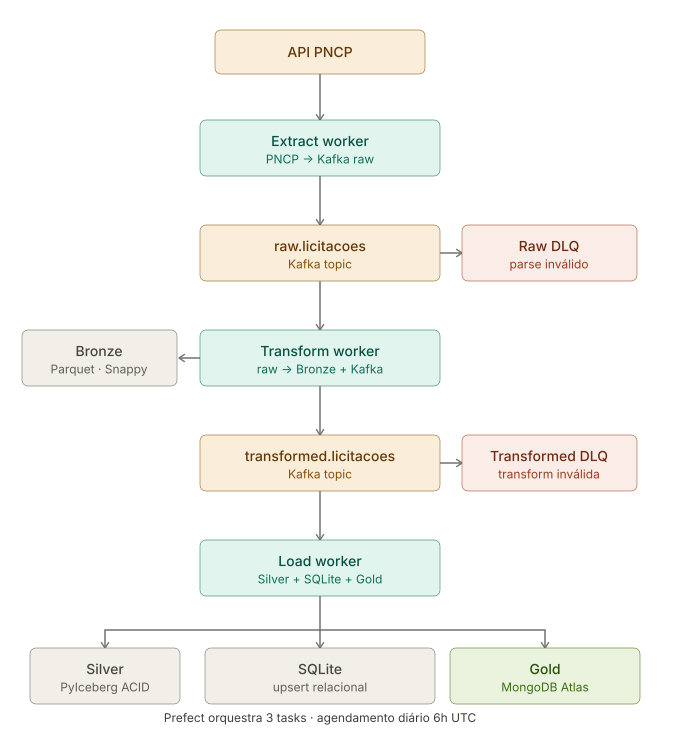

# Pipeline Licitei — Arquitetura Medallion

[](https://python.org)
[](https://kafka.apache.org)
[](https://mongodb.com)
[](https://prefect.io)
[](https://pydantic.dev)

**Track 1 + 1B** — Projeto Integrador · CESAR School · ADS 5º período · Responsável: [Vyktor Nascimento](https://www.linkedin.com/in/vyktornascimento/)

Pipeline de dados em tempo real que extrai licitações da API pública do PNCP, processa através de três camadas Medallion e persiste no MongoDB Atlas para consumo pelo backend e pelo assistente IA.

---

## Arquitetura



O pipeline opera com três workers independentes se comunicando via Kafka. Mensagens com falha de parse ou transformação são isoladas em DLQs, garantindo que erros não bloqueiem o fluxo principal.

---

## Camadas de dados

| Camada | Tecnologia | Localização | Características |
| --- | --- | --- | --- |
| **Bronze** | Parquet (Snappy) | `data/bronze/.../year/month/day/` | Dado bruto imutável, particionado por data |
| **Silver** | Apache Iceberg | `data/iceberg/` | ACID, deduplicação por `numero_controle_pncp`, time travel |
| **SQLite** | SQLite | `data/licitacoes.db` | Upsert relacional (requisito acadêmico de Eng. de Dados) |
| **Gold** | MongoDB Atlas | 6 coleções (`contratos_ativos` + 5 KPI) | Contratos enriquecidos e KPIs para backend, MCP e dashboard |

### Coleções Gold (MongoDB)

| Coleção | Conteúdo |
| --- | --- |
| `contratos_ativos` | Contratos enriquecidos — coleção principal consumida pelo backend e MCP |
| `kpi_por_uf` | Total de editais e valor médio por UF |
| `kpi_por_modalidade` | Contagem e valor total por modalidade de contratação |
| `kpi_prazos` | Editais encerrando em 7, 15 e 30 dias |
| `kpi_elegibilidade` | Editais dentro do teto MEI (R$81k) |
| `kpi_dashboard` | Totais gerais: count, valor total, órgãos, editais ativos |

> Os KPIs são recalculados após cada ciclo de ingestão via agregação sobre a coleção `contratos_ativos` completa, garantindo que reflitam o dataset total e não apenas o último batch.

---

## Kafka Topics

| Tópico | Producer | Consumer | Semântica |
| --- | --- | --- | --- |
| `raw.licitacoes` | Extract Worker | Transform Worker | Dado bruto validado pelo Pydantic `RawLicitacao` |
| `raw.licitacoes.dlq` | Extract Worker | Monitoramento | Mensagens com falha de parse |
| `transformed.licitacoes` | Transform Worker | Load Worker | Dado enriquecido validado pelo Pydantic `SilverLicitacao` |
| `transformed.licitacoes.dlq` | Transform Worker | Monitoramento | Mensagens com falha de transformação |

**Infraestrutura:** Zookeeper + `confluentinc/cp-kafka:7.5.0` · Client Python: `confluent-kafka==2.3.0`

---

## Dashboard

O dashboard Streamlit lê diretamente as coleções Gold no MongoDB e exibe KPIs em tempo real: editais ativos, valor total, distribuição por UF e prazo, elegibilidade MEI e status de saúde do pipeline por camada.

<!-- 
  Adicione um screenshot do dashboard aqui depois de capturar.
  Caminho sugerido: docs/assets/screenshots/pipeline-dashboard.png
  Para capturar: streamlit run dashboard/app.py
-->

---

## Setup

```bash
cd pipeline

# Criar e ativar ambiente virtual
python -m venv .venv

# Windows
.venv\Scripts\activate

# Linux / Mac
source .venv/bin/activate

# Instalar dependências
pip install -r requirements.txt

# Configurar variáveis de ambiente
cp .env.example .env
# Edite .env com suas credenciais (Kafka, MongoDB, caminhos de dados)
```

---

## Execução manual

Execute cada worker em um terminal separado:

```bash
# Terminal 1 — Subir Kafka (Docker obrigatório)
cd kafka && docker compose up -d && cd ..

# Terminal 2 — Transform Worker (aguarda mensagens do Kafka)
python workers/transform_worker.py

# Terminal 3 — Load Worker (aguarda mensagens transformadas)
python workers/load_worker.py

# Terminal 4 — Extract Worker (inicia o pipeline)
python workers/extract_worker.py --dataInicial 20260601 --dataFinal 20260602

# Terminal 5 — Dashboard (opcional)
streamlit run dashboard/app.py
```

---

## Execução orquestrada (Prefect)

```bash
# Execução única
python orchestration/flows.py

# Agendamento diário às 6h UTC
python orchestration/flows.py --serve
```

---

## Testes

```bash
cd pipeline
pytest tests/ -v
```

---

## Estrutura

```
pipeline/
├── workers/
│   ├── extract_worker.py      # Producer: PNCP → raw.licitacoes
│   ├── transform_worker.py    # Consumer+Producer: raw → Bronze + transformed
│   └── load_worker.py         # Consumer: transformed → Silver + SQLite + Gold
├── kafka/
│   └── docker-compose.yml     # Zookeeper + Kafka 7.5.0
├── src/
│   ├── config.py              # Variáveis de ambiente unificadas
│   ├── contracts.py           # Contratos Pydantic (Raw, Silver, 5x Gold)
│   ├── ingestion/extractor.py # PNCPExtractor com paginação e retry
│   ├── bronze/writer.py       # Parquet particionado por data
│   ├── silver/transformer.py  # PyIceberg ACID + dedup
│   └── gold/loader.py         # 5 coleções KPI no MongoDB
├── orchestration/
│   └── flows.py               # Prefect: 3 tasks sequenciais, cron 6h UTC
├── dashboard/
│   └── app.py                 # Streamlit: KPIs + saúde do pipeline
├── tests/                     # Testes unitários por camada
├── requirements.txt
└── .env.example
```

---

## Variáveis de ambiente

| Variável | Obrigatória | Descrição |
| --- | --- | --- |
| `KAFKA_BOOTSTRAP_SERVERS` | Sim | Ex: `localhost:9092` |
| `PNCP_CODIGO_MODALIDADE` | Sim | Código da modalidade a extrair |
| `PNCP_DATA_INICIAL` | Sim | Data inicial no formato `YYYYMMDD` |
| `PNCP_DATA_FINAL` | Sim | Data final no formato `YYYYMMDD` |
| `BRONZE_BASE_PATH` | Sim | Caminho local para os arquivos Parquet |
| `ICEBERG_CATALOG_PATH` | Sim | Caminho local para o catálogo Iceberg |
| `SQLITE_DB_PATH` | Sim | Caminho para o arquivo `.db` SQLite |
| `MONGO_URI` | Sim | URI do MongoDB Atlas |
| `MONGO_DB_NAME` | Sim | Nome do banco (ex: `licitei`) |

Ver `.env.example` para a lista completa com valores padrão.

---

## Histórico de sprints

As implementações anteriores estão preservadas no histórico git:

- **Sprint 1 — ETL + PySpark + Dashboard:** commit `6eb46d1` (pasta `etl/`)
- **Sprint 2 — Kafka Producer/Consumer + Bronze Parquet:** commit `d039770` (pasta `dataops/`)

```bash
git show HEAD~5          # navega pelo histórico
git log --oneline etl/   # commits da pasta etl/
```
